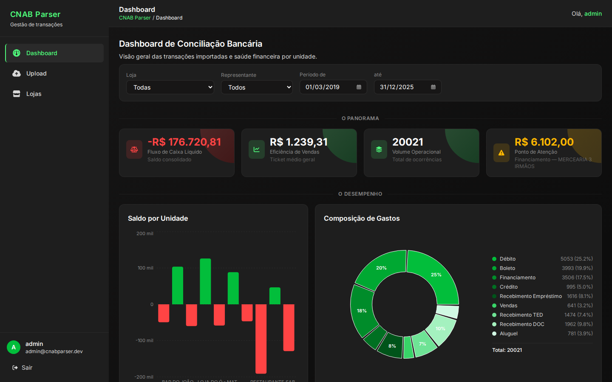
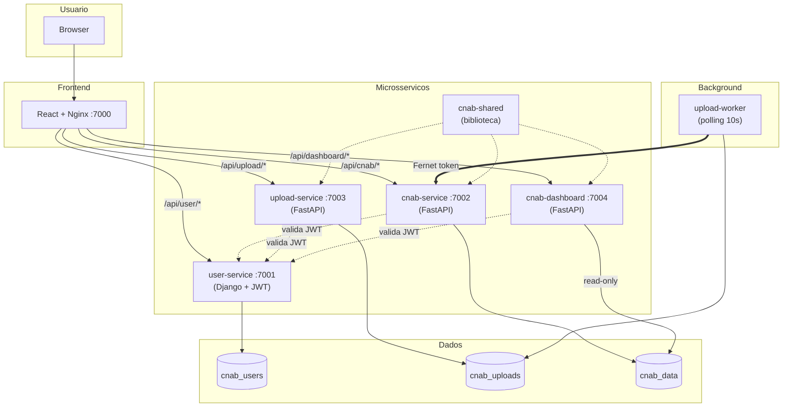

<p align="center">
  <h1 align="center">CNAB Parser</h1>
</p>

<p align="center">
  
  
  
  
  
  
  
  
</p>

<p align="center">
  Sistema web para importacao, normalizacao e visualizacao de transacoes financeiras no formato <b>CNAB</b> (Centro Nacional de Automacao Bancaria), com autenticacao JWT, dashboard analitico e interface moderna.
</p>

---

## Dashboard



---

## Visao Geral

O **CNAB Parser** recebe arquivos CNAB no formato de largura fixa, interpreta e normaliza os dados (transacoes financeiras de multiplas lojas) e armazena em banco de dados relacional. A interface web permite upload dos arquivos e exibe um dashboard analitico completo com KPIs, graficos e detalhamento de transacoes.

### Fluxo Principal

```
Upload CNAB -> Validacao -> Parsing (largura fixa) -> Normalizacao -> Persistencia -> Dashboard
```

| Etapa | Descricao |
|-------|-----------|
| **Upload** | Formulario web com drag & drop aceita arquivos .txt/.cnab |
| **Validacao** | Verifica formato, tamanho de linha e tipos validos |
| **Parsing** | Extrai campos de largura fixa (tipo, data, valor, CPF, cartao, hora, dono, loja) |
| **Normalizacao** | Valor / 100, datas ISO, strip de nomes |
| **Persistencia** | Cria/reutiliza lojas, vincula transacoes, deduplicacao via content hash |
| **Dashboard** | KPIs, graficos de saldo/composicao/hora e detalhamento paginado |

## Funcionalidades

- **Upload** de arquivos CNAB via formulario com drag & drop
- **Parsing** completo do formato de largura fixa (9 tipos de transacao)
- **Deduplicacao** automatica via SHA-256 content hash (upload duplicado nao insere dados)
- **Dashboard analitico** com 3 camadas narrativas (Panorama, Desempenho, Operacao)
- **KPIs** com tooltips explicativos (Fluxo de Caixa, Ticket Medio, Volume, Ponto de Atencao)
- **Graficos** interativos (barras, donut, area) com filtros globais
- **Listagem por loja** com totalizador de saldo (entradas - saidas)
- **Detalhe de transacoes** com paginacao server-side, ordenacao e filtros
- **Autenticacao JWT** com login e gestao de usuarios
- **Documentacao interativa** da API (Swagger UI e Redoc)
- **Historico de uploads** com filtros por status, nome e data
- **Interface responsiva** com tema bycoders_ e CSS customizado

## Estrutura do Projeto

```
desafio-dev/
├── user-service/            # Autenticacao e gestao de usuarios (Django + DRF + JWT)
├── upload-service/          # Upload, parsing e processamento CNAB (FastAPI)
├── cnab-service/            # Armazenamento e consulta de lojas/transacoes (FastAPI)
├── cnab-dashboard/          # Dashboard analitico read-only (FastAPI)
├── cnab-shared/             # Biblioteca compartilhada (BaseModel, BaseRepository, auth, middleware)
├── frontend-service/        # Interface web (React + TypeScript + Vite + Tailwind + Recharts)
├── configs/                 # Variaveis de ambiente e init scripts do PostgreSQL
├── scripts/                 # Script de setup e gerador de dados de teste
├── docs/                    # Documentacao Spec-Driven, ADRs e colecoes Postman
├── assets/                  # Arquivos CNAB de exemplo e screenshots
├── docker-compose.yml       # Orquestracao de containers
└── Makefile                 # Automacao de comandos
```

### Arquitetura (containers)



| Servico | Porta Host | Porta Interna | Banco | Descricao |
|---------|-----------|---------------|-------|-----------|
| frontend | 7000 | 3000 | - | Interface React + Nginx (proxy reverso) |
| user-service | 7001 | 8001 | cnab_users | Autenticacao e gestao de usuarios |
| cnab-service | 7002 | 8002 | cnab_data | Armazenamento e consulta de transacoes |
| upload-service | 7003 | 8003 | cnab_uploads | Upload, parsing e processamento CNAB |
| cnab-dashboard | 7004 | 8004 | cnab_data (read-only) | Dashboard analitico |
| upload-worker | - | - | cnab_uploads | Processamento em background (polling 10s) |
| db | 5435 | 5432 | - | PostgreSQL 16 (3 bancos) |
| redis | 6380 | 6379 | - | Cache |

## Instalacao

### Pre-requisitos

- [Docker](https://docs.docker.com/get-docker/) e [Docker Compose](https://docs.docker.com/compose/install/)
- [Make](https://www.gnu.org/software/make/) (opcional, mas recomendado)
- Git

### Setup completo (primeira vez)

```bash
# 1. Clone o repositorio
git clone https://github.com/LucasBiason/desafio-dev.git
cd desafio-dev

# 2. Copie o arquivo de configuracao
cp configs/.env.example configs/.env

# 3. Instale tudo com um unico comando
make setup
```

O `make setup` executa automaticamente:
- Build das imagens Docker
- Criacao dos bancos de dados (cnab_users, cnab_data, cnab_uploads)
- Migracoes do user-service (Django)
- Migracoes do cnab-service (Alembic + seed dos tipos de transacao)
- Migracoes do upload-service (Alembic)
- Criacao do usuario administrador

Ao final, o sistema estara disponivel em:

| Servico | URL |
|---------|-----|
| Frontend | http://localhost:7000 |
| Swagger | http://localhost:7001/swagger/ |
| Redoc | http://localhost:7001/redoc/ |

**Login:** `admin` / `admin123`

### Execucao diaria

```bash
make up       # Sobe a stack
make down     # Para todos os containers
make restart  # Reinicia os containers
make health   # Verifica saude de todos os servicos
```

### Usar a aplicacao

1. Acesse http://localhost:7000
2. Faca login com `admin` / `admin123`
3. Faca upload do arquivo CNAB (disponivel em `assets/CNAB.txt`)
4. Visualize o dashboard analitico com KPIs, graficos e detalhamento

### Testes

```bash
make test            # Todos os testes (4 servicos)
make test-user       # user-service (106 testes, 98%)
make test-cnab       # cnab-service (83 testes, 98%)
make test-upload     # upload-service (53 testes, 100%)
make test-dashboard  # cnab-dashboard (108 testes, 96%)
make lint            # Ruff check + format
```

**Total: 350 testes automatizados + 40 testes de integracao**

### Comandos uteis

```bash
make health          # Verifica saude de todos os servicos
make migrate         # Aplica migracoes pendentes
make shell-user      # Shell no user-service
make shell-cnab      # Shell no cnab-service
make shell-dashboard # Shell no cnab-dashboard
make shell-db        # psql no PostgreSQL
make logs            # Logs de todos os servicos
make logs-worker     # Logs do upload-worker
make clean           # Remove volumes e containers (apaga dados)
```

## API

### Endpoints principais

**user-service (porta 7001):**

| Metodo | Endpoint | Descricao |
|--------|----------|-----------|
| POST | `/auth/v1/login/` | Login (retorna JWT) |
| POST | `/auth/v1/validate/` | Validacao do token |
| GET | `/users/v1/users/` | Lista usuarios (paginado) |
| POST | `/users/v1/users/` | Cadastro de usuario |

**upload-service (porta 7003):**

| Metodo | Endpoint | Descricao |
|--------|----------|-----------|
| POST | `/upload/` | Upload de arquivo CNAB |
| GET | `/uploads/` | Historico de uploads (paginado, filtros por status/data) |
| GET | `/uploads/{id}/` | Detalhe de um upload |

**cnab-service (porta 7002):**

| Metodo | Endpoint | Descricao |
|--------|----------|-----------|
| GET | `/stores/` | Lista lojas com saldo (paginado, filtros por nome/dono) |
| GET | `/stores/{id}` | Detalhe de uma loja |
| GET | `/transactions/` | Transacoes por loja (filtros: tipo, natureza, data) |
| GET | `/transactions/{id}` | Detalhe de uma transacao |
| GET | `/transaction-types/` | 9 tipos de transacao CNAB |
| POST | `/transactions/upload/` | Insercao via Fernet (upload-service) |

**cnab-dashboard (porta 7004):**

| Metodo | Endpoint | Descricao |
|--------|----------|-----------|
| GET | `/summary` | KPIs gerais (lojas, transacoes, receita, despesa, saldo) |
| GET | `/balance-by-store` | Saldo por loja (grafico de barras) |
| GET | `/transactions-by-type` | Distribuicao por tipo (grafico donut) |
| GET | `/transactions-by-hour` | Densidade por hora (grafico de area) |
| GET | `/advanced-kpis` | Fluxo de caixa, ticket medio, ponto de atencao |
| GET | `/transactions-detail` | Detalhamento paginado com ordenacao |
| GET | `/available-filters` | Opcoes para filtros dinamicos |
| GET | `/uploads-timeline` | Timeline de transacoes por data |

Todos os endpoints do dashboard aceitam filtros: `store_id`, `owner_name`, `date_from`, `date_to`.

### Documentacao interativa

| URL | Ferramenta |
|-----|-----------|
| `http://localhost:7001/swagger/` | Swagger UI (user-service) |
| `http://localhost:7001/redoc/` | Redoc (user-service) |
| `http://localhost:7002/docs` | Swagger UI (cnab-service) |
| `http://localhost:7004/docs` | Swagger UI (cnab-dashboard) |

### Colecao Postman

Disponivel em `docs/Postman Collections/` com todos os endpoints, exemplos de sucesso/erro e scripts de automacao de token.

## Documentacao

| Recurso | Descricao |
|---------|-----------|
| [Contexto do Sistema](docs/00-context/system-context.md) | Visao geral, stack e restricoes |
| [Problem Statement](docs/00-context/problem-statement.md) | Problema, objetivo e criterios de aceite |
| [Glossario](docs/00-context/glossary.md) | Termos e definicoes do dominio |
| [Requisitos Funcionais](docs/10-requirements/functional-requirements.md) | RF-001 a RF-008 detalhados |
| [Arquitetura](docs/20-design/architecture.md) | Camadas, diretorios e responsabilidades |
| [Modelo de Dados](docs/20-design/data-model.md) | Diagrama ER e detalhamento das tabelas |
| [Contratos de API](docs/20-design/api-contracts.md) | Endpoints, request/response, status codes |
| [Diagrama DB](docs/20-design/dbdiagram.dbml) | DBML para visualizar em dbdiagram.io |
| [ADR-001](docs/90-decisions/ADR-001-upload-service-separation.md) | Separacao do upload-service e autenticacao Fernet |
| [README Original](docs/README-original.md) | Enunciado original do desafio |

## Tecnologias

| Categoria | Stack |
|-----------|-------|
| **Auth Service** | Django 5 - DRF - PyJWT - drf-yasg |
| **Upload Service** | FastAPI - cnab-shared - Fernet |
| **CNAB Service** | FastAPI - SQLAlchemy - Pydantic V2 - Alembic |
| **Dashboard Service** | FastAPI - SQL otimizado - cnab-shared |
| **Shared Library** | cnab-shared (BaseModel, BaseRepository, auth, middleware, dependencies) |
| **Frontend** | React 19 - TypeScript 5.9 - Vite 8 - Tailwind CSS - Recharts - Font Awesome |
| **Banco de Dados** | PostgreSQL 16 (3 bancos isolados por servico) |
| **Cache** | Redis 7 |
| **Infra** | Docker Compose - Nginx (proxy reverso) - Makefile |
| **Auth Inter-servico** | Fernet Token (upload-worker -> cnab-service) |
| **Qualidade** | pytest (350 testes) - Ruff - Coverage (96%+) |

## Formato CNAB

O arquivo CNAB contem linhas de 80 caracteres com campos de largura fixa:

| Campo | Inicio | Fim | Tamanho | Descricao |
|-------|--------|-----|---------|-----------|
| Tipo | 1 | 1 | 1 | Tipo da transacao (1-9) |
| Data | 2 | 9 | 8 | Data da ocorrencia (YYYYMMDD) |
| Valor | 10 | 19 | 10 | Valor em centavos (dividir por 100) |
| CPF | 20 | 30 | 11 | CPF do beneficiario |
| Cartao | 31 | 42 | 12 | Cartao utilizado |
| Hora | 43 | 48 | 6 | Hora da ocorrencia (HHMMSS) |
| Dono da Loja | 49 | 62 | 14 | Nome do representante |
| Nome Loja | 63 | 80 | 18 | Nome da loja |

### Tipos de Transacao

| Tipo | Descricao | Natureza | Sinal |
|------|-----------|----------|-------|
| 1 | Debito | Entrada | + |
| 2 | Boleto | Saida | - |
| 3 | Financiamento | Saida | - |
| 4 | Credito | Entrada | + |
| 5 | Recebimento Emprestimo | Entrada | + |
| 6 | Vendas | Entrada | + |
| 7 | Recebimento TED | Entrada | + |
| 8 | Recebimento DOC | Entrada | + |
| 9 | Aluguel | Saida | - |

## Licenca

MIT
