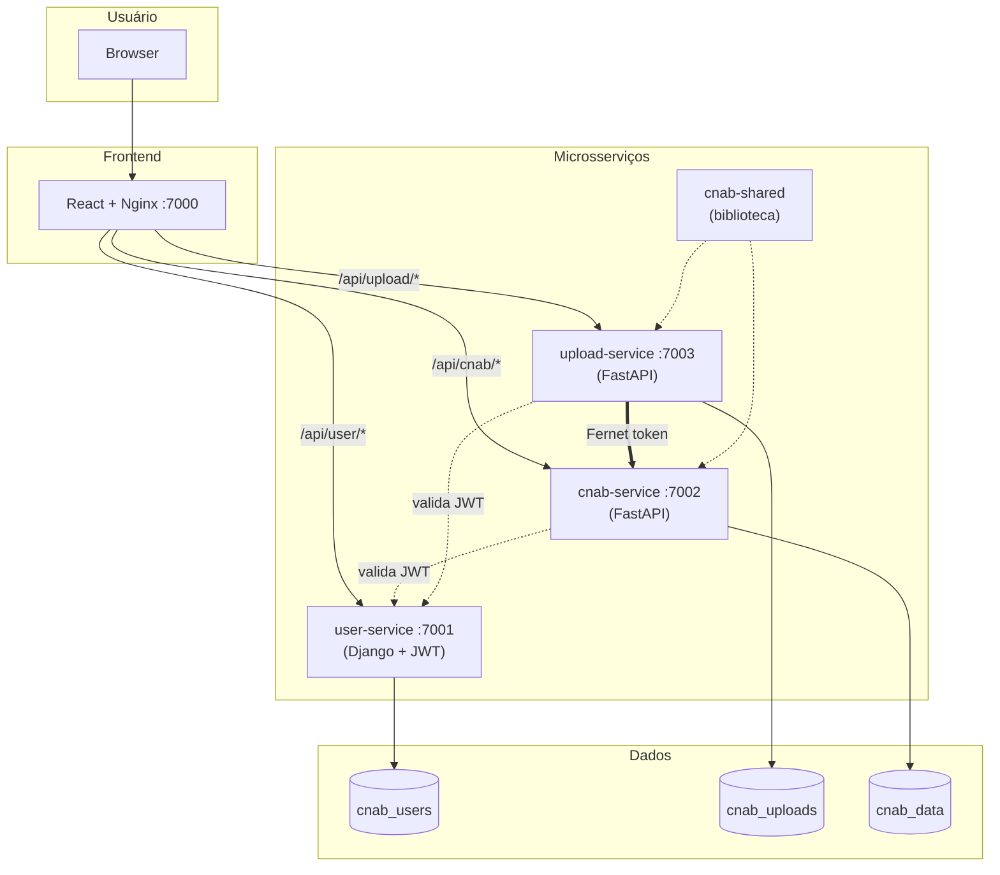

<p align="center">
  <h1 align="center">CNAB Parser</h1>
</p>

<p align="center">
  
  
  
  
  
  
  
  
</p>

<p align="center">
  Sistema web para importação, normalização e visualização de transações financeiras no formato <b>CNAB</b> (Centro Nacional de Automação Bancária), com autenticação JWT e interface moderna.
</p>

---

## Visão Geral

O **CNAB Parser** recebe arquivos CNAB no formato de largura fixa, interpreta e normaliza os dados (transações financeiras de múltiplas lojas) e armazena em banco de dados relacional. A interface web permite upload dos arquivos e exibe as transações agrupadas por loja com totalizador de saldo.

### Fluxo Principal

```
Upload CNAB → Validação → Parsing (largura fixa) → Normalização → Persistência → Visualização
```

| Etapa | Descrição |
|-------|-----------|
| **Upload** | Formulário web aceita arquivos .txt/.cnab |
| **Validação** | Verifica formato, tamanho de linha e tipos válidos |
| **Parsing** | Extrai campos de largura fixa (tipo, data, valor, CPF, cartão, hora, dono, loja) |
| **Normalização** | Valor / 100, datas, strip de nomes, fuso UTC-3 |
| **Persistência** | Cria/reutiliza lojas, vincula transações, registra histórico |
| **Visualização** | Lista lojas com saldo (entradas - saídas) e detalhe de transações |

## Funcionalidades

- **Upload** de arquivos CNAB via formulário com drag & drop
- **Parsing** completo do formato de largura fixa (9 tipos de transação)
- **Listagem por loja** com totalizador de saldo (entradas - saídas)
- **Detalhe de transações** por loja com filtros por tipo e data
- **Autenticação JWT** com login e gestão de usuários
- **Documentação interativa** da API (Swagger UI e Redoc)
- **Histórico de uploads** com status de processamento
- **Interface responsiva** com tema Nord e CSS customizado

## Estrutura do Projeto

```
desafio-dev/
├── user-service/            # Autenticação e gestão de usuários (Django + DRF + JWT)
├── upload-service/          # Upload, parsing e processamento CNAB (FastAPI)
├── cnab-service/            # Armazenamento e consulta de lojas/transações (FastAPI)
├── cnab-shared/             # Biblioteca compartilhada (BaseModel, BaseRepository, middleware)
├── frontend-service/        # Interface web (React + TypeScript + Vite + Tailwind Nord)
├── configs/                 # Variáveis de ambiente e init scripts do PostgreSQL
├── scripts/                 # Script de setup (instalação com um comando)
├── docs/                    # Documentação Spec-Driven e ADRs
├── assets/                  # Arquivo CNAB de exemplo e screenshots
├── docker-compose.yml       # Orquestração de containers
└── Makefile                 # Automação de comandos
```

### Arquitetura (containers)



| Serviço | Porta Host | Porta Interna | Banco | Descrição |
|---------|-----------|---------------|-------|-----------|
| frontend | 7000 | 3000 | — | Interface React + Nginx (proxy reverso) |
| user-service | 7001 | 8001 | cnab_users | Autenticação e gestão de usuários |
| upload-service | 7003 | 8003 | cnab_uploads | Upload, parsing e processamento CNAB |
| cnab-service | 7002 | 8002 | cnab_data | Armazenamento e consulta de transações |
| db | 5435 | 5432 | — | PostgreSQL 16 (3 bancos) |
| redis | 6380 | 6379 | — | Cache e sessões |

### Arquitetura do Backend (camadas)

```
Request HTTP
    │
    ▼
[View/Router] ──── Recebe request, extrai dados, retorna response
    │
    ▼
[Serializer] ───── Valida e serializa request/response
    │
    ▼
[Controller] ───── Orquestra lógica de negócio
    │
    ├──────────────────────────┐
    │           │              │
    ▼           ▼              ▼
[Repository] [Validator]  [Service/Parser]
    │           │              │
    ▼           │              ▼
[Model/DB]   [Regras]    [CNAB File / Cache]
```

## Instalação

### Pré-requisitos

- [Docker](https://docs.docker.com/get-docker/) e [Docker Compose](https://docs.docker.com/compose/install/)
- [Make](https://www.gnu.org/software/make/) (opcional, mas recomendado)
- Git

### Setup completo (primeira vez)

```bash
# 1. Clone o repositório
git clone https://github.com/LucasBiason/desafio-dev.git
cd desafio-dev

# 2. Copie o arquivo de configuração
cp configs/.env.example configs/.env

# 3. Instale tudo com um único comando
make setup
```

O `make setup` executa automaticamente:
- Build das imagens Docker
- Criação dos bancos de dados (cnab_users + cnab_data)
- Migrações do user-service (Django)
- Migrações do cnab-service (Alembic + seed dos tipos de transação)
- Criação do usuário administrador

Ao final, o sistema estará disponível em:

| Serviço | URL |
|---------|-----|
| Frontend | http://localhost:7000 |
| User Service | http://localhost:7001 |
| CNAB Service | http://localhost:7002 |
| Swagger | http://localhost:7001/swagger/ |
| Redoc | http://localhost:7001/redoc/ |

**Login:** `admin` / `admin123`

### Execução diária

```bash
make up       # Sobe a stack (se já estiver instalada)
make down     # Para todos os containers
make restart  # Reinicia os containers
```

### Usar a aplicação

1. Acesse http://localhost:7000
2. Faça login com `admin` / `admin123`
3. Faça upload do arquivo CNAB (disponível em `assets/CNAB.txt`)
4. Visualize as transações agrupadas por loja com saldo

### Testes

```bash
make test       # Executa todos os testes com cobertura
make test-user  # Apenas user-service
make test-cnab  # Apenas cnab-service
make lint       # Ruff check + format
```

### Comandos úteis

```bash
make health       # Verifica saúde de todos os serviços
make migrate      # Aplica migrações pendentes
make shell-user   # Shell no user-service
make shell-cnab   # Shell no cnab-service
make shell-db     # psql no PostgreSQL
make logs         # Logs de todos os serviços
make clean        # Remove volumes e containers (apaga dados)
```

## API

### Endpoints principais

**user-service (porta 7001):**

| Método | Endpoint | Descrição |
|--------|----------|-----------|
| POST | `/auth/v1/login/` | Login (retorna JWT) |
| POST | `/auth/v1/validate/` | Validação do token |
| GET | `/users/v1/users/` | Lista usuários (paginado) |
| POST | `/users/v1/users/` | Cadastro de usuário |
| GET | `/users/v1/users/{id}/` | Detalhe do usuário |
| PATCH | `/users/v1/users/{id}/` | Atualização parcial |
| DELETE | `/users/v1/users/{id}/` | Desativação (soft delete) |

**upload-service (porta 7003):**

| Método | Endpoint | Descrição |
|--------|----------|-----------|
| POST | `/upload/` | Upload de arquivo CNAB |
| GET | `/uploads/` | Histórico de uploads (paginado) |
| GET | `/uploads/{id}/` | Detalhe de um upload |

**cnab-service (porta 7002):**

| Método | Endpoint | Descrição |
|--------|----------|-----------|
| GET | `/stores/` | Lista lojas com saldo (paginado) |
| GET | `/stores/{id}/transactions/` | Transações de uma loja (paginado) |
| GET | `/transaction-types/` | Tipos de transação CNAB |
| POST | `/internal/transactions/` | Inserção interna (Fernet token) |

### Documentação interativa

| URL | Ferramenta |
|-----|-----------|
| `http://localhost:7001/swagger/` | Swagger UI |
| `http://localhost:7001/redoc/` | Redoc |

### Exemplo de uso (curl)

```bash
# Login
curl -X POST http://localhost:7001/auth/v1/login/ \
  -H "Content-Type: application/json" \
  -d '{"username": "admin", "password": "admin123"}'

# Listar usuários (com token)
curl http://localhost:7001/users/v1/users/ \
  -H "Authorization: Bearer <encoded_token>"

# Upload CNAB (via upload-service)
curl -X POST http://localhost:7003/upload/ \
  -H "Authorization: Bearer <encoded_token>" \
  -F "file=@assets/CNAB.txt"

# Listar lojas com saldo (via cnab-service)
curl http://localhost:7002/stores/ \
  -H "Authorization: Bearer <encoded_token>"
```

## Documentação

| Recurso | Descrição |
|---------|-----------|
| [Contexto do Sistema](docs/00-context/system-context.md) | Visão geral, stack e restrições |
| [Problem Statement](docs/00-context/problem-statement.md) | Problema, objetivo e critérios de aceite |
| [Glossário](docs/00-context/glossary.md) | Termos e definições do domínio |
| [Requisitos Funcionais](docs/10-requirements/functional-requirements.md) | RF-001 a RF-006 detalhados |
| [Arquitetura](docs/20-design/architecture.md) | Camadas, diretórios e responsabilidades |
| [Modelo de Dados](docs/20-design/data-model.md) | Diagrama ER e detalhamento das tabelas |
| [Contratos de API](docs/20-design/api-contracts.md) | Endpoints, request/response, status codes |
| [Diagrama DB](docs/20-design/dbdiagram.dbml) | DBML para visualizar em dbdiagram.io |
| [ADR-001](docs/90-decisions/ADR-001-upload-service-separation.md) | Separação do upload-service e autenticação Fernet |
| [README Original](docs/README-original.md) | Enunciado original do desafio |

## Tecnologias

| Categoria | Stack |
|-----------|-------|
| **Auth Service** | Django 5 · DRF · PyJWT |
| **Upload Service** | FastAPI · cnab-shared · Fernet |
| **CNAB Service** | FastAPI · SQLAlchemy · Pydantic V2 · Alembic |
| **Shared Library** | cnab-shared (BaseModel, BaseRepository, middleware) |
| **Frontend** | React 18 · TypeScript · Vite · Tailwind CSS (tema Nord) · Font Awesome |
| **Banco de Dados** | PostgreSQL 16 (3 bancos isolados por serviço) |
| **Cache** | Redis 7 |
| **Infra** | Docker Compose · Nginx (proxy reverso) · Makefile |
| **Auth Inter-serviço** | Fernet Token (upload-service → cnab-service) |
| **Qualidade** | pytest · Ruff · Coverage (98%+) |

## Formato CNAB

O arquivo CNAB contém linhas de 81 caracteres com campos de largura fixa:

| Campo | Início | Fim | Tamanho | Descrição |
|-------|--------|-----|---------|-----------|
| Tipo | 1 | 1 | 1 | Tipo da transação (1-9) |
| Data | 2 | 9 | 8 | Data da ocorrência (YYYYMMDD) |
| Valor | 10 | 19 | 10 | Valor em centavos (dividir por 100) |
| CPF | 20 | 30 | 11 | CPF do beneficiário |
| Cartão | 31 | 42 | 12 | Cartão utilizado |
| Hora | 43 | 48 | 6 | Hora da ocorrência (HHMMSS, UTC-3) |
| Dono da Loja | 49 | 62 | 14 | Nome do representante |
| Nome Loja | 63 | 81 | 19 | Nome da loja |

### Tipos de Transação

| Tipo | Descrição | Natureza | Sinal |
|------|-----------|----------|-------|
| 1 | Débito | Entrada | + |
| 2 | Boleto | Saída | - |
| 3 | Financiamento | Saída | - |
| 4 | Crédito | Entrada | + |
| 5 | Recebimento Empréstimo | Entrada | + |
| 6 | Vendas | Entrada | + |
| 7 | Recebimento TED | Entrada | + |
| 8 | Recebimento DOC | Entrada | + |
| 9 | Aluguel | Saída | - |

## Licença

MIT
