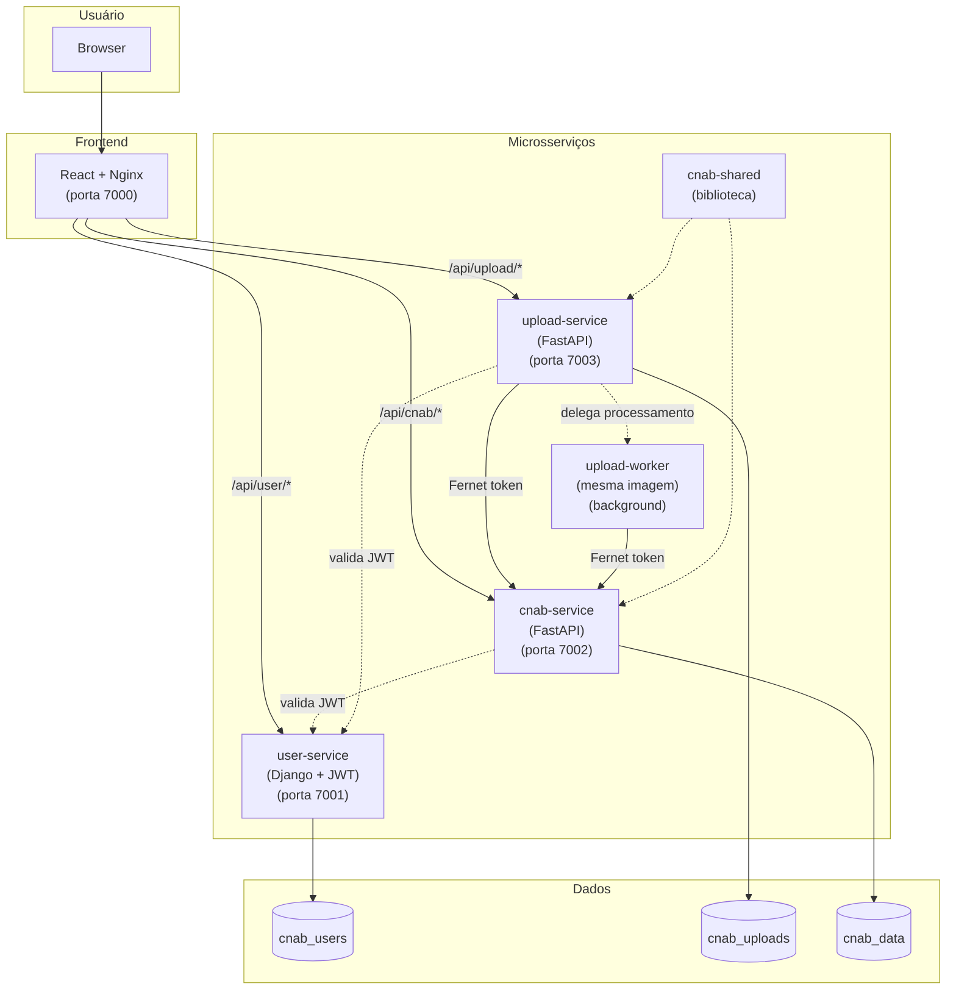

# System Context

## Visão Geral

Sistema web para importação e visualização de transações financeiras no formato CNAB (Centro Nacional de Automação Bancária). O sistema permite upload de arquivos CNAB, parsing e normalização dos dados, armazenamento em banco relacional, exibição das transações agrupadas por loja com totalizador de saldo e um dashboard analítico de conciliação bancária com visão em três camadas narrativas.

## Stakeholders

| Stakeholder | Papel | Interesse |
|-------------|-------|-----------|
| Avaliador Bycoders | Avaliador técnico | Qualidade do código, testes, arquitetura |
| Operador | Usuário final | Upload e visualização de transações |

## Contexto do Sistema

## Restrições

- Ambiente Unix (Linux/macOS)
- Apenas linguagens e bibliotecas livres/gratuitas
- Banco relacional: PostgreSQL
- Docker Compose para orquestração
- Git com commits atômicos e bem descritos

## Decisões de Stack

| Camada | Tecnologia | Justificativa |
|--------|-----------|---------------|
| Auth Service | Django 5 + DRF + PyJWT | Autenticação e gestão de usuários |
| Upload Service | FastAPI + cnab-shared | Upload e parsing de arquivos CNAB |
| Upload Worker | mesma imagem do upload-service | Processamento em background (polling a cada 10s) |
| CNAB Service | FastAPI + SQLAlchemy + Pydantic V2 | Armazenamento, consulta de transações e analytics do dashboard |
| Shared Library | cnab-shared | Código compartilhado entre microsserviços FastAPI |
| Frontend | React 18 + TypeScript + Vite + Tailwind | SPA moderna com paleta bycoders_ |
| Database | PostgreSQL 16 (3 bancos) | Isolamento por serviço |
| Infra | Docker Compose + Nginx | Orquestração e proxy reverso |
| Auth Inter-serviço | Fernet Token | Comunicação segura upload-service → cnab-service |
| Auth Usuário | JWT (PyJWT) | Autenticação do usuário no frontend |
| Docs API | Swagger/Redoc (drf-yasg) | Diferencial solicitado |

## Decisões Arquiteturais

| ADR | Decisão |
|-----|---------|
| [ADR-001](../90-decisions/ADR-001-upload-service-separation.md) | Separação do upload-service do cnab-service com autenticação Fernet |
