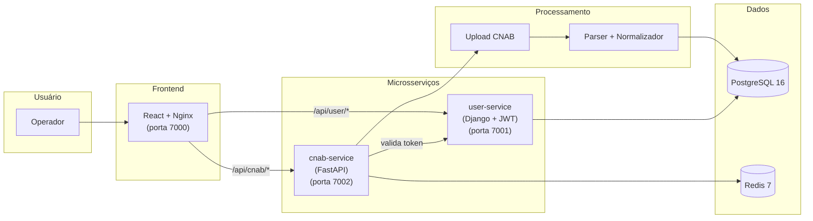

# System Context

## Visão Geral

Sistema web para importação e visualização de transações financeiras no formato CNAB (Centro Nacional de Automação Bancária). O sistema permite upload de arquivos CNAB, parsing e normalização dos dados, armazenamento em banco relacional e exibição das transações agrupadas por loja com totalizador de saldo.

## Stakeholders

| Stakeholder | Papel | Interesse |
|-------------|-------|-----------|
| Avaliador Bycoders | Avaliador técnico | Qualidade do código, testes, arquitetura |
| Operador | Usuário final | Upload e visualização de transações |

## Contexto do Sistema

## Restrições

- Ambiente Unix (Linux/macOS)
- Apenas linguagens e bibliotecas livres/gratuitas
- Banco relacional: PostgreSQL
- Docker Compose para orquestração
- Git com commits atômicos e bem descritos

## Decisões de Stack

| Camada | Tecnologia | Justificativa |
|--------|-----------|---------------|
| Auth Service | Django 5 + DRF + PyJWT | Autenticação e gestão de usuários |
| CNAB Service | FastAPI + SQLAlchemy + Pydantic V2 | Processamento de arquivos CNAB |
| Shared Library | cnab-shared | Código compartilhado entre microsserviços |
| Frontend | React 18 + TypeScript + Vite + Tailwind | SPA moderna com tema Nord |
| Database | PostgreSQL 16 | Requisito do desafio, melhor DB relacional |
| Cache | Redis 7 | Cache e sessões |
| Infra | Docker Compose + Nginx | Orquestração e proxy reverso |
| CI | Makefile | Automação de comandos |
| Auth | JWT (PyJWT) | Diferencial solicitado |
| Docs API | Swagger/Redoc (drf-yasg) | Diferencial solicitado |
