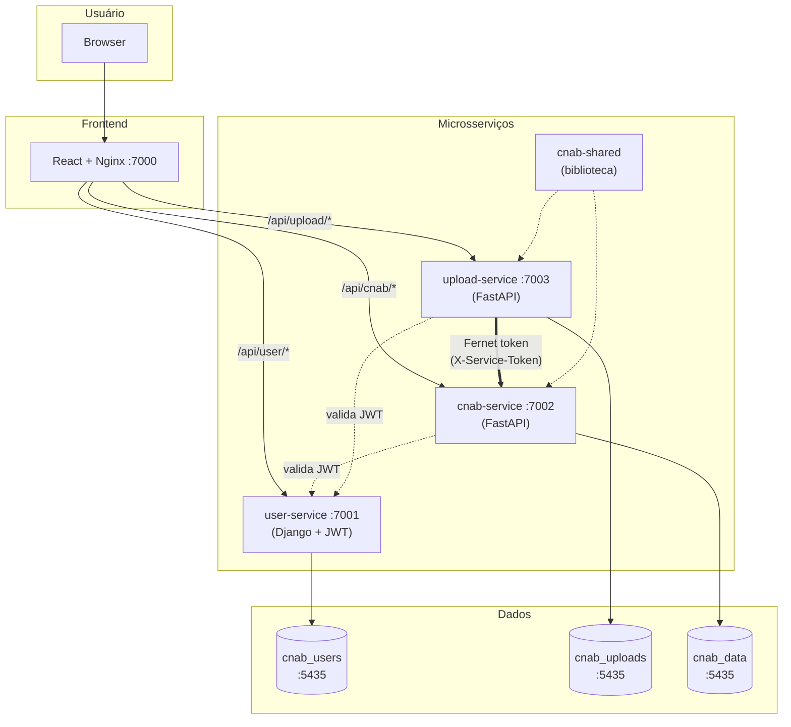

# Arquitetura do Sistema

## Visão Geral

Arquitetura de microsserviços com três backends (user-service em Django, upload-service e cnab-service em FastAPI), biblioteca compartilhada (cnab-shared), SPA React como frontend e Nginx como proxy reverso. Orquestrado via Docker Compose.



## Microsserviços

| Serviço | Stack | Porta | Responsabilidade |
|---------|-------|-------|------------------|
| user-service | Django 5 + DRF + PyJWT | 7001 | Autenticação JWT e gestão de usuários |
| upload-service | FastAPI + cnab-shared | 7003 | Upload de arquivos CNAB, parsing, processamento em background |
| cnab-service | FastAPI + SQLAlchemy + Pydantic V2 | 7002 | Armazenamento e consulta de lojas, transações e saldos |
| cnab-shared | Python package | — | Biblioteca compartilhada (BaseModel, BaseRepository, middleware, exceptions) |
| frontend-service | React 18 + TypeScript + Vite + Tailwind | 7000 | Interface web (Nginx como proxy reverso) |

## Comunicação entre Serviços

### Usuário → Frontend → Backend (JWT)

O frontend envia o token JWT do usuário no header `Authorization: Bearer <token>`. Os serviços upload-service e cnab-service validam o token consultando o user-service.

### Upload-service → CNAB-service (Fernet Token)

A comunicação entre upload-service e cnab-service usa **Fernet token** para autenticação:

1. O upload-service gera um token Fernet com payload `{"service": "upload-service", "timestamp": "..."}`
2. Envia no header `X-Service-Token`
3. O cnab-service descriptografa e valida (TTL integrado — tokens expiram automaticamente)
4. Endpoints de inserção de dados **só aceitam** chamadas com token Fernet válido

A chave Fernet (`SERVICE_SECRET_KEY`) é compartilhada via variável de ambiente entre os dois serviços.

> **Decisão:** [ADR-001 — Separação do upload-service](../90-decisions/ADR-001-upload-service-separation.md)

## Bancos de Dados

Cada microsserviço possui seu próprio banco no mesmo PostgreSQL:

| Banco | Serviço | Tabelas | Migrations |
|-------|---------|---------|------------|
| cnab_users | user-service | auth_user, django_* | Django migrations |
| cnab_uploads | upload-service | cnab_upload_history | Alembic |
| cnab_data | cnab-service | cnab_store, cnab_transaction, cnab_transaction_type | Alembic |

## Fluxo de Upload

```
1. Usuário faz upload do arquivo CNAB via frontend
2. Frontend envia POST /api/upload/ com o arquivo + JWT
3. upload-service:
   a. Valida JWT do usuário
   b. Armazena o arquivo
   c. Cria registro em cnab_upload_history (status: "processing")
   d. Parseia o arquivo CNAB (largura fixa → dados normalizados)
   e. Chama a API do cnab-service com Fernet token para inserir dados
   f. Atualiza status para "completed" ou "failed"
4. cnab-service:
   a. Valida Fernet token
   b. Cria/reutiliza lojas
   c. Insere transações
   d. Retorna resultado
```

## Camadas do Backend

```
Request HTTP
    │
    ▼
[View/Router] ──── Recebe request, extrai dados, retorna response
    │
    ▼
[Serializer] ───── Valida e serializa request/response
    │
    ▼
[Controller] ───── Orquestra lógica de negócio
    │
    ├──────────────────────────┐
    │           │              │
    ▼           ▼              ▼
[Repository] [Validator]  [Service]
    │           │              │
    ▼           │              ▼
[Model/DB]   [Regras]    [JWT / Fernet / Parser]
```

### Responsabilidade de Cada Camada

| Camada | Responsabilidade | NÃO faz |
|--------|-----------------|---------|
| **View/Router** | Receber HTTP request, extrair dados, chamar controller, retornar response | Lógica de negócio, acesso a DB |
| **Serializer** | Definir schema de request/response, validação de tipo/formato | Lógica de negócio, acesso a DB |
| **Controller** | Orquestrar fluxo de negócio, chamar validator + repository + service | Acesso direto ao DB, receber request HTTP |
| **Repository** | Acessar banco de dados via ORM, encapsular queries | Lógica de negócio, validação |
| **Validator** | Validar regras de negócio, permissões, consistência | Acesso a DB direto, response HTTP |
| **Service** | Integrações externas (JWT, Fernet, cache, parser CNAB) | Lógica de negócio core |
| **Model** | Definir estrutura de dados, relacionamentos, constraints | Lógica de negócio |

## Estrutura de Diretórios

```
desafio-dev/
├── user-service/                    # Microsserviço de autenticação (Django)
│   ├── app/
│   │   ├── core/                    # Settings, URLs, handlers, middleware, views
│   │   ├── authentication/          # JWT (login, validate)
│   │   └── users/                   # User CRUD (models, controllers, repositories)
│   ├── tests/
│   ├── Dockerfile
│   └── entrypoint.sh
│
├── upload-service/                  # Microsserviço de upload (FastAPI)
│   ├── app/
│   │   ├── models/                  # UploadHistory
│   │   ├── controllers/             # UploadController
│   │   ├── repositories/            # UploadHistoryRepository
│   │   ├── services/                # CNABParser, CNABServiceClient (Fernet)
│   │   ├── routers/                 # Upload endpoints
│   │   └── schemas/                 # Request/response models
│   ├── tests/
│   ├── alembic/                     # Migrations (cnab_uploads)
│   ├── Dockerfile
│   └── entrypoint.sh
│
├── cnab-service/                    # Microsserviço de dados CNAB (FastAPI)
│   ├── app/
│   │   ├── models/                  # Store, Transaction, TransactionType
│   │   ├── controllers/             # StoreController, TransactionController
│   │   ├── repositories/            # StoreRepository, TransactionRepository
│   │   ├── services/                # FernetValidator
│   │   ├── routers/                 # Store/Transaction endpoints + internal endpoint
│   │   └── schemas/                 # Request/response models
│   ├── tests/
│   ├── alembic/                     # Migrations (cnab_data)
│   ├── Dockerfile
│   └── entrypoint.sh
│
├── cnab-shared/                     # Biblioteca compartilhada
│   └── cnab_shared/
│       ├── setup_api.py             # CNABFastAPI (CORS, middleware, routers)
│       ├── config/                  # DatabaseConfig, ServiceConfig
│       ├── database/                # SQLAlchemy engine, get_db(), Base
│       ├── models/                  # BaseModel (UUID PK, soft delete, timestamps)
│       ├── repository/              # BaseRepository[T] (CRUD genérico)
│       ├── middleware/              # AuthMiddleware, CatchExceptionsMiddleware, LoggingMiddleware
│       ├── exceptions/              # Hierarquia de exceções customizadas
│       ├── schemas/                 # PaginationParams, PaginatedResponse
│       ├── routers/                 # Health check router factory
│       ├── logging/                 # LoggerConfig, get_logger
│       └── services/                # UserService (valida JWT via user-service)
│
├── frontend-service/                # SPA React
│   ├── src/
│   │   ├── components/              # Sidebar, Header, Layout, ProtectedRoute
│   │   ├── pages/                   # Login, Dashboard, Upload, Stores, History
│   │   ├── hooks/                   # useAuth
│   │   ├── services/                # api.ts (axios), authService.ts
│   │   └── types/                   # Interfaces TypeScript
│   ├── Dockerfile                   # Multi-stage: build (Node) → runtime (Nginx)
│   └── nginx.conf                   # Proxy reverso
│
├── configs/                         # Variáveis de ambiente
│   ├── .env
│   ├── .env.example
│   └── postgres/init-databases.sh   # Cria os 3 bancos no startup
├── scripts/
│   └── setup.sh                     # Instalação completa com um comando
├── docs/                            # Documentação Spec-Driven
│   ├── 00-context/
│   ├── 10-requirements/
│   ├── 20-design/
│   ├── 90-decisions/                # ADRs
│   └── Postman Collections/
├── assets/                          # Arquivo CNAB de exemplo
├── docker-compose.yml
├── Makefile
└── README.md
```

## Serviços Docker Compose

| Serviço | Imagem | Porta Host | Porta Interna | Banco | Função |
|---------|--------|-----------|---------------|-------|--------|
| db | postgres:16-alpine | 5435 | 5432 | — | PostgreSQL (3 bancos) |
| redis | redis:7-alpine | 6380 | 6379 | — | Cache e sessões |
| user-service | custom (Django) | 7001 | 8001 | cnab_users | Autenticação e gestão de usuários |
| upload-service | custom (FastAPI) | 7003 | 8003 | cnab_uploads | Upload e processamento CNAB |
| cnab-service | custom (FastAPI) | 7002 | 8002 | cnab_data | Armazenamento e consulta de transações |
| frontend | custom (React+Nginx) | 7000 | 3000 | — | Interface web e proxy reverso |

## Dockerfiles (Multi-stage)

Todos os serviços backend seguem o padrão de 3 stages:

| Stage | Conteúdo | Uso |
|-------|----------|-----|
| **base** | Dependências runtime + código da aplicação | Compartilhado entre test e runtime |
| **test** | Herda de base + pytest, ruff, .coveragerc, tests/ | CI e desenvolvimento (`make test`) |
| **runtime** | Herda de base + non-root user + OCI labels | Imagem de produção |
