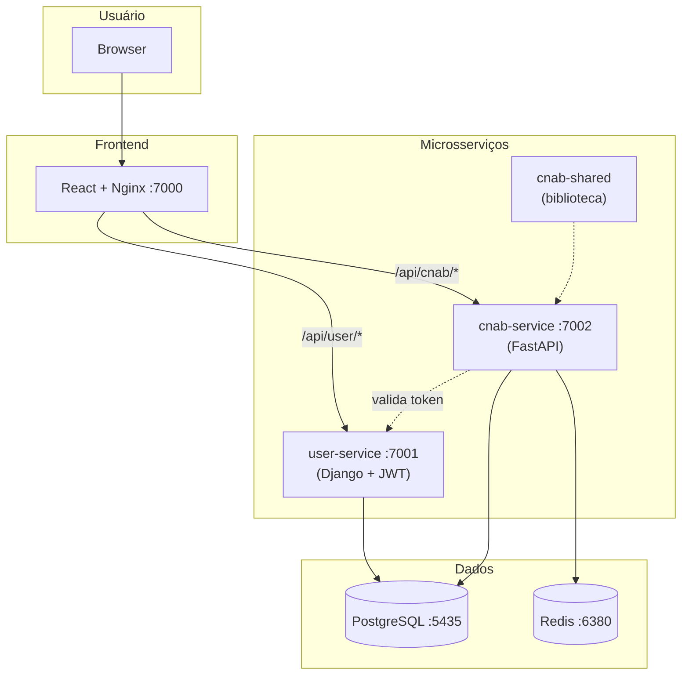

# Arquitetura do Sistema

## Visão Geral

Arquitetura de microsserviços com dois backends (user-service em Django, cnab-service em FastAPI), biblioteca compartilhada (cnab-shared), SPA React como frontend e Nginx como proxy reverso. Orquestrado via Docker Compose.



## Microsserviços

| Serviço | Stack | Porta | Responsabilidade |
|---------|-------|-------|------------------|
| user-service | Django 5 + DRF + PyJWT | 7001 | Autenticação JWT e gestão de usuários |
| cnab-service | FastAPI + SQLAlchemy + Pydantic V2 | 7002 | Upload, parsing e visualização de transações CNAB |
| cnab-shared | Python package | — | Biblioteca compartilhada (BaseModel, BaseRepository, middleware, exceptions) |
| frontend-service | React 18 + TypeScript + Vite + Tailwind | 7000 | Interface web (Nginx como proxy reverso) |

## Camadas do Backend

```
Request HTTP
    │
    ▼
[View/Router] ──── Recebe request, extrai dados, retorna response
    │
    ▼
[Serializer] ───── Valida e serializa request/response
    │
    ▼
[Controller] ───── Orquestra lógica de negócio
    │
    ├──────────────────────────┐
    │           │              │
    ▼           ▼              ▼
[Repository] [Validator]  [Service]
    │           │              │
    ▼           │              ▼
[Model/DB]   [Regras]    [JWT / Cache / Parser]
```

### Responsabilidade de Cada Camada

| Camada | Responsabilidade | NÃO faz |
|--------|-----------------|---------|
| **View/Router** | Receber HTTP request, extrair dados, chamar controller, retornar response | Lógica de negócio, acesso a DB |
| **Serializer** | Definir schema de request/response, validação de tipo/formato | Lógica de negócio, acesso a DB |
| **Controller** | Orquestrar fluxo de negócio, chamar validator + repository + service | Acesso direto ao DB, receber request HTTP |
| **Repository** | Acessar banco de dados via ORM, encapsular queries | Lógica de negócio, validação |
| **Validator** | Validar regras de negócio, permissões, consistência | Acesso a DB direto, response HTTP |
| **Service** | Integrações externas (JWT, cache, parser CNAB) | Lógica de negócio core |
| **Model** | Definir estrutura de dados, relacionamentos, constraints | Lógica de negócio |

## Estrutura de Diretórios

```
desafio-dev/
├── user-service/                    # Microsserviço de autenticação (Django)
│   ├── app/
│   │   ├── core/                    # Settings, URLs, handlers, views (health, swagger)
│   │   │   ├── settings.py
│   │   │   ├── urls.py
│   │   │   ├── handlers.py
│   │   │   ├── views/               # HealthView, schema_view (swagger)
│   │   │   └── serializers/         # HealthSerializer
│   │   ├── authentication/          # App: JWT Authentication
│   │   │   ├── controllers/         # JWTAuthentication (login, validate, authenticate)
│   │   │   ├── services/            # AccessToken (encode, decode, validate)
│   │   │   ├── serializers/         # LoginSerializer, UserSerializer
│   │   │   ├── views/               # Login, Validator (APIView)
│   │   │   ├── models/              # User (custom AbstractBaseUser)
│   │   │   ├── managers/            # UserManager
│   │   │   ├── exceptions.py        # BaseAPIException + custom exceptions
│   │   │   └── schemas.py           # Swagger decorators
│   │   └── users/                   # App: User Management (CRUD)
│   │       ├── controllers/         # UserController
│   │       ├── repositories/        # UserRepository
│   │       ├── validators/          # UserValidator + exceptions
│   │       ├── serializers/         # UserSerializer
│   │       └── views/               # ManageUserView (ViewSet)
│   ├── tests/                       # Fora do app/
│   │   ├── conftest.py
│   │   ├── authentication/
│   │   └── users/
│   ├── Dockerfile                   # Multi-stage: base → test → runtime
│   ├── entrypoint.sh
│   ├── requirements.txt
│   └── requirements-test.txt
│
├── cnab-service/                    # Microsserviço CNAB (FastAPI)
│   ├── app/
│   │   └── main.py                  # CNABFastAPI().setup() + health check
│   ├── tests/
│   ├── Dockerfile                   # Multi-stage: base → test → runtime
│   ├── entrypoint.sh
│   ├── requirements.txt
│   └── requirements-test.txt
│
├── cnab-shared/                     # Biblioteca compartilhada
│   └── cnab_shared/
│       ├── setup_api.py             # CNABFastAPI (CORS, middleware, routers)
│       ├── config/                  # DatabaseConfig, ServiceConfig
│       ├── database/                # SQLAlchemy engine, get_db(), Base
│       ├── models/                  # BaseModel (UUID PK, soft delete, timestamps)
│       ├── repository/              # BaseRepository[T] (CRUD genérico)
│       ├── middleware/              # AuthMiddleware, CatchExceptionsMiddleware
│       ├── exceptions/              # Hierarquia de exceções customizadas
│       ├── schemas/                 # PaginationParams, PaginatedResponse
│       ├── routers/                 # Health check router
│       └── services/                # UserService (valida token via user-service)
│
├── frontend-service/                # SPA React
│   ├── src/
│   │   ├── components/              # Sidebar, Header, Layout, ProtectedRoute
│   │   ├── pages/                   # Login, Register, Dashboard, Upload, Stores
│   │   ├── hooks/                   # useAuth
│   │   ├── services/                # api.ts (axios), authService.ts
│   │   └── types/                   # Interfaces TypeScript
│   ├── Dockerfile                   # Multi-stage: build (Node) → runtime (Nginx)
│   └── nginx.conf                   # Proxy reverso para user-service e cnab-service
│
├── configs/                         # Variáveis de ambiente
│   ├── .env
│   └── .env.example
├── docs/                            # Documentação Spec-Driven
│   ├── 00-context/
│   ├── 10-requirements/
│   ├── 20-design/
│   └── Postman Collections/
├── assets/                          # Arquivo CNAB de exemplo
├── docker-compose.yml
├── Makefile
├── .gitignore
├── .editorconfig
├── CHANGELOG.md
└── README.md
```

## Serviços Docker Compose

| Serviço | Imagem | Porta Host | Porta Interna | Função |
|---------|--------|-----------|---------------|--------|
| db | postgres:16-alpine | 5435 | 5432 | Banco de dados |
| redis | redis:7-alpine | 6380 | 6379 | Cache e sessões |
| user-service | custom (Django) | 7001 | 8001 | Autenticação e gestão de usuários |
| cnab-service | custom (FastAPI) | 7002 | 8002 | Processamento CNAB |
| frontend | custom (React+Nginx) | 7000 | 3000 | Interface web e proxy reverso |

## Dockerfiles (Multi-stage)

Todos os serviços backend seguem o padrão de 3 stages:

| Stage | Conteúdo | Uso |
|-------|----------|-----|
| **base** | Dependências runtime + código da aplicação | Compartilhado entre test e runtime |
| **test** | Herda de base + pytest, ruff, .coveragerc, tests/ | CI e desenvolvimento (`make test`) |
| **runtime** | Herda de base + non-root user + OCI labels | Imagem de produção |
