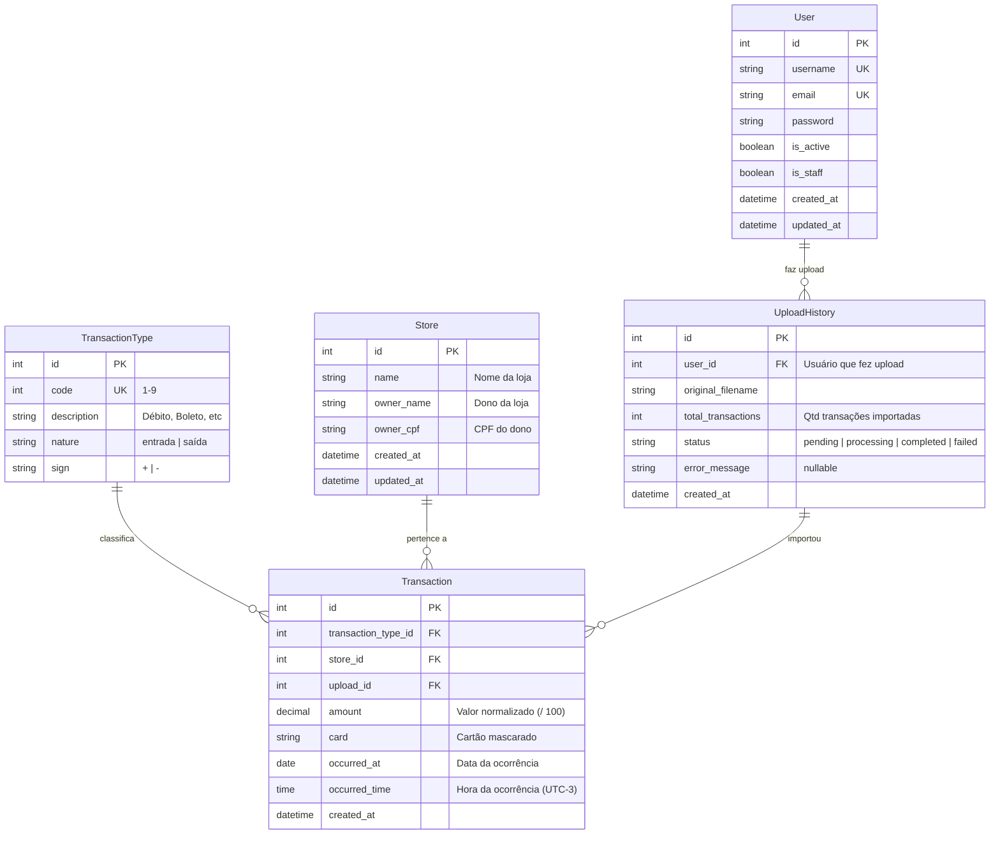

# Data Model

## Diagrama ER (Mermaid)



## Detalhamento das Tabelas

### `auth_user` (Custom User Model)

| Campo | Tipo | Constraints | Descrição |
|-------|------|-------------|-----------|
| id | SERIAL | PK | Identificador |
| username | VARCHAR(150) | UNIQUE, NOT NULL | Nome de usuário |
| email | VARCHAR(254) | UNIQUE, NOT NULL | E-mail |
| password | VARCHAR(128) | NOT NULL | Hash da senha |
| is_active | BOOLEAN | DEFAULT true | Usuário ativo |
| is_staff | BOOLEAN | DEFAULT false | Acesso ao admin |
| created_at | TIMESTAMPTZ | auto_now_add | Data de criação |
| updated_at | TIMESTAMPTZ | auto_now | Data de atualização |

### `cnab_transaction_type` (Tabela de Referência - Seed)

| Campo | Tipo | Constraints | Descrição |
|-------|------|-------------|-----------|
| id | SERIAL | PK | Identificador |
| code | SMALLINT | UNIQUE, NOT NULL | Código 1-9 |
| description | VARCHAR(50) | NOT NULL | Descrição do tipo |
| nature | VARCHAR(10) | NOT NULL | "entrada" ou "saída" |
| sign | CHAR(1) | NOT NULL | "+" ou "-" |

**Dados seed (migration):**

| code | description | nature | sign |
|------|-------------|--------|------|
| 1 | Débito | entrada | + |
| 2 | Boleto | saída | - |
| 3 | Financiamento | saída | - |
| 4 | Crédito | entrada | + |
| 5 | Recebimento Empréstimo | entrada | + |
| 6 | Vendas | entrada | + |
| 7 | Recebimento TED | entrada | + |
| 8 | Recebimento DOC | entrada | + |
| 9 | Aluguel | saída | - |

### `cnab_store`

| Campo | Tipo | Constraints | Descrição |
|-------|------|-------------|-----------|
| id | SERIAL | PK | Identificador |
| name | VARCHAR(50) | NOT NULL | Nome da loja |
| owner_name | VARCHAR(50) | NOT NULL | Nome do dono |
| owner_cpf | VARCHAR(11) | NOT NULL | CPF do dono |
| created_at | TIMESTAMPTZ | auto_now_add | Data de criação |
| updated_at | TIMESTAMPTZ | auto_now | Data de atualização |

**Unique constraint:** `(name, owner_cpf)` — mesma loja com mesmo CPF não duplica.

### `cnab_upload_history`

| Campo | Tipo | Constraints | Descrição |
|-------|------|-------------|-----------|
| id | SERIAL | PK | Identificador |
| user_id | INTEGER | FK(auth_user), NULL | Usuário que fez upload (null se sem auth) |
| original_filename | VARCHAR(255) | NOT NULL | Nome original do arquivo |
| total_transactions | INTEGER | DEFAULT 0 | Qtd de transações importadas |
| status | VARCHAR(20) | NOT NULL, DEFAULT 'pending' | Status do processamento |
| error_message | TEXT | NULL | Mensagem de erro se falhou |
| created_at | TIMESTAMPTZ | auto_now_add | Data do upload |

### `cnab_transaction`

| Campo | Tipo | Constraints | Descrição |
|-------|------|-------------|-----------|
| id | SERIAL | PK | Identificador |
| transaction_type_id | INTEGER | FK(cnab_transaction_type), NOT NULL | Tipo da transação |
| store_id | INTEGER | FK(cnab_store), NOT NULL | Loja |
| upload_id | INTEGER | FK(cnab_upload_history), NOT NULL | Upload de origem |
| amount | DECIMAL(10,2) | NOT NULL | Valor normalizado |
| card | VARCHAR(20) | NOT NULL | Cartão mascarado |
| occurred_at | DATE | NOT NULL | Data da ocorrência |
| occurred_time | TIME | NOT NULL | Hora (UTC-3) |
| created_at | TIMESTAMPTZ | auto_now_add | Data de inserção |

**Índice:** `(store_id, occurred_at)` — otimiza consulta de transações por loja.

## Cálculo de Saldo por Loja

```sql
SELECT
    s.id,
    s.name,
    s.owner_name,
    COALESCE(SUM(
        CASE WHEN tt.sign = '+' THEN t.amount
             ELSE -t.amount
        END
    ), 0) as balance
FROM cnab_store s
LEFT JOIN cnab_transaction t ON t.store_id = s.id
LEFT JOIN cnab_transaction_type tt ON tt.id = t.transaction_type_id
GROUP BY s.id, s.name, s.owner_name
ORDER BY s.name;
```
