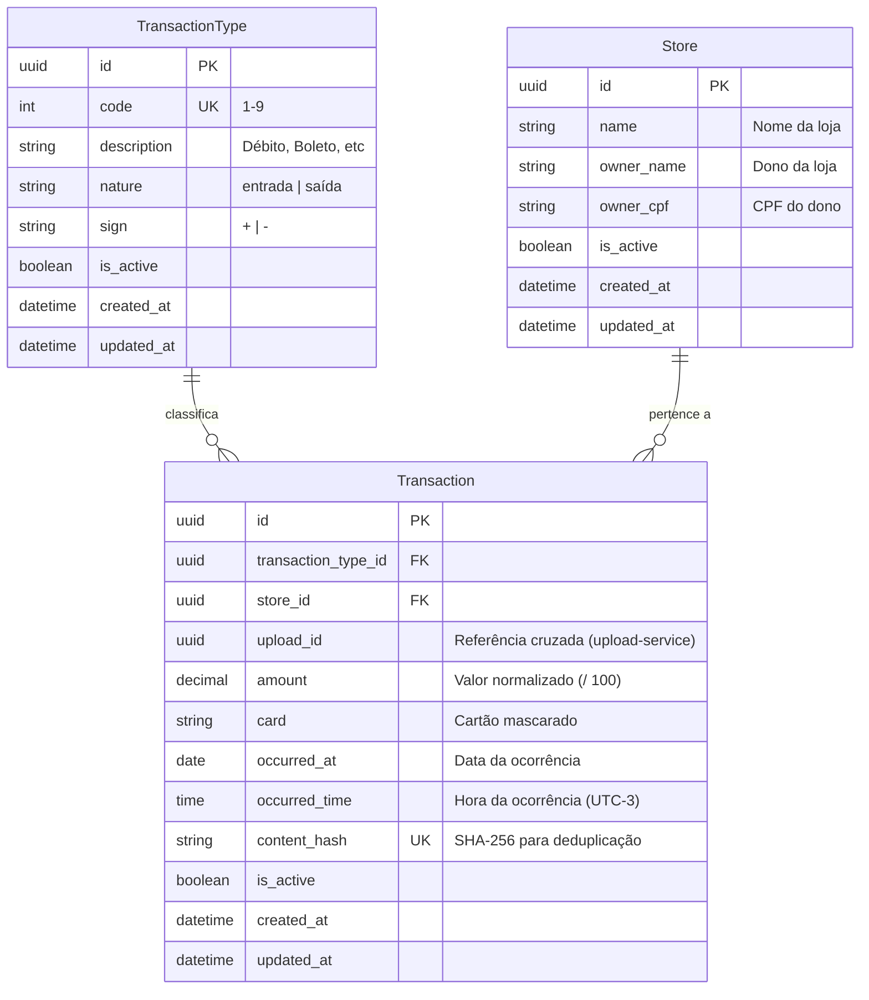
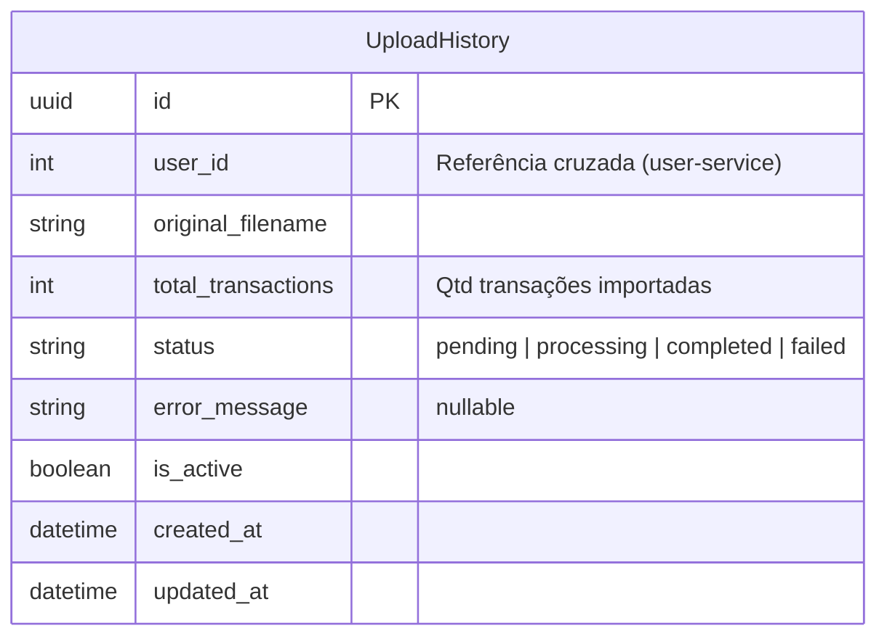
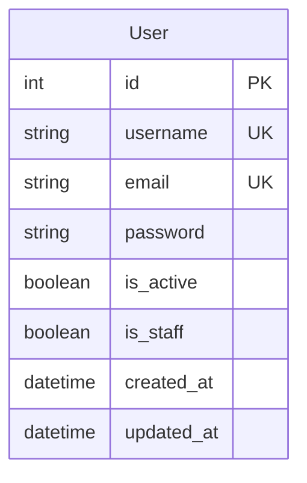

# Data Model

## Visão Geral

Os dados estão distribuídos em 3 bancos PostgreSQL, cada um gerenciado pelo seu microsserviço:

| Banco | Serviço | Tabelas |
|-------|---------|---------|
| cnab_users | user-service | auth_user |
| cnab_uploads | upload-service | cnab_upload_history |
| cnab_data | cnab-service | cnab_store, cnab_transaction, cnab_transaction_type |

## Diagrama ER — cnab_data (cnab-service)



## Diagrama ER — cnab_uploads (upload-service)



## Diagrama ER — cnab_users (user-service)



## Campos Padrão (BaseModel - cnab-shared)

Todas as tabelas dos serviços FastAPI herdam do BaseModel:

| Campo | Tipo | Descrição |
|-------|------|-----------|
| id | UUID | Chave primária gerada automaticamente |
| is_active | BOOLEAN (NOT NULL, default true) | Controle de soft delete |
| created_at | TIMESTAMPTZ (NOT NULL, default now()) | Data de criação |
| updated_at | TIMESTAMPTZ (NOT NULL, default now(), auto-update) | Data da última atualização |
| inactivated_at | TIMESTAMPTZ (nullable) | Data de inativação (soft delete) |

## Detalhamento das Tabelas

### `cnab_transaction_type` (cnab_data — Seed)

| Campo | Tipo | Constraints | Descrição |
|-------|------|-------------|-----------|
| id | UUID | PK | Identificador |
| code | SMALLINT | UNIQUE, NOT NULL | Código 1-9 |
| description | VARCHAR(50) | NOT NULL | Descrição do tipo |
| nature | VARCHAR(10) | NOT NULL | "entrada" ou "saída" |
| sign | CHAR(1) | NOT NULL | "+" ou "-" |
| + campos BaseModel | | | |

**Dados seed (migration):**

| code | description | nature | sign |
|------|-------------|--------|------|
| 1 | Débito | entrada | + |
| 2 | Boleto | saída | - |
| 3 | Financiamento | saída | - |
| 4 | Crédito | entrada | + |
| 5 | Recebimento Empréstimo | entrada | + |
| 6 | Vendas | entrada | + |
| 7 | Recebimento TED | entrada | + |
| 8 | Recebimento DOC | entrada | + |
| 9 | Aluguel | saída | - |

### `cnab_store` (cnab_data)

| Campo | Tipo | Constraints | Descrição |
|-------|------|-------------|-----------|
| id | UUID | PK | Identificador |
| name | VARCHAR(50) | NOT NULL | Nome da loja |
| owner_name | VARCHAR(50) | NOT NULL | Nome do dono |
| owner_cpf | VARCHAR(11) | NOT NULL | CPF do dono |
| + campos BaseModel | | | |

**Unique constraint:** `(name, owner_cpf)` — mesma loja com mesmo CPF não duplica.

### `cnab_upload_history` (cnab_uploads)

| Campo | Tipo | Constraints | Descrição |
|-------|------|-------------|-----------|
| id | UUID | PK | Identificador |
| user_id | INTEGER | NULL | ID do usuário (referência cruzada ao user-service) |
| original_filename | VARCHAR(255) | NOT NULL | Nome original do arquivo |
| total_transactions | INTEGER | DEFAULT 0 | Qtd de transações importadas |
| status | VARCHAR(20) | NOT NULL, DEFAULT 'pending' | Status do processamento |
| error_message | TEXT | NULL | Mensagem de erro se falhou |
| + campos BaseModel | | | |

### `cnab_transaction` (cnab_data)

| Campo | Tipo | Constraints | Descrição |
|-------|------|-------------|-----------|
| id | UUID | PK | Identificador |
| transaction_type_id | UUID | FK(cnab_transaction_type), NOT NULL | Tipo da transação |
| store_id | UUID | FK(cnab_store), NOT NULL | Loja |
| upload_id | UUID | NOT NULL | ID do upload (referência cruzada ao upload-service) |
| amount | DECIMAL(10,2) | NOT NULL | Valor normalizado |
| card | VARCHAR(20) | NOT NULL | Cartão mascarado |
| occurred_at | DATE | NOT NULL | Data da ocorrência |
| occurred_time | TIME | NOT NULL | Hora (UTC-3) |
| content_hash | VARCHAR(64) | UNIQUE, NOT NULL | SHA-256 calculado sobre os campos da transação para deduplicação |
| + campos BaseModel | | | |

**Índice:** `(store_id, occurred_at)` — otimiza consulta de transações por loja.

**Unique constraint:** `content_hash` — garante que a mesma transação não seja inserida mais de uma vez, mesmo que o arquivo seja enviado repetidamente.

**Nota:** `upload_id` é uma referência cruzada (não FK real) ao banco cnab_uploads do upload-service.

## Cálculo de Saldo por Loja

```sql
SELECT
    s.id,
    s.name,
    s.owner_name,
    COALESCE(SUM(
        CASE WHEN tt.sign = '+' THEN t.amount
             ELSE -t.amount
        END
    ), 0) as balance
FROM cnab_store s
LEFT JOIN cnab_transaction t ON t.store_id = s.id
LEFT JOIN cnab_transaction_type tt ON tt.id = t.transaction_type_id
GROUP BY s.id, s.name, s.owner_name
ORDER BY s.name;
```
